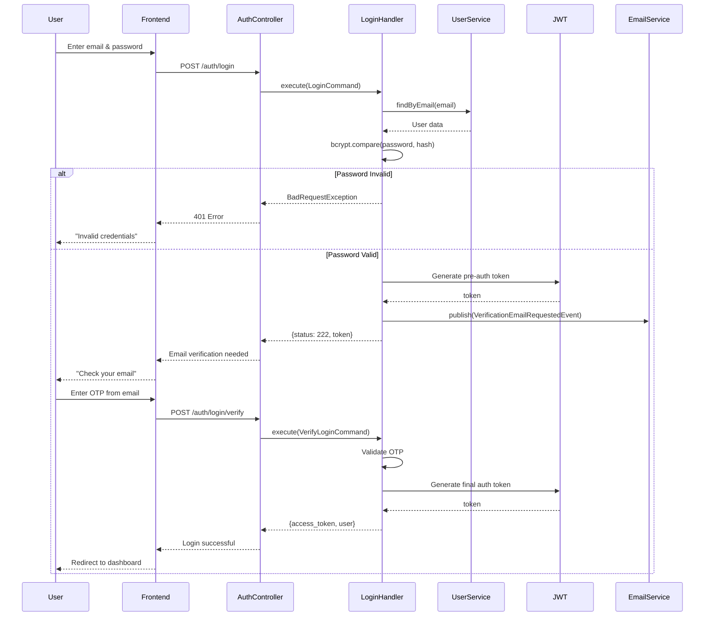
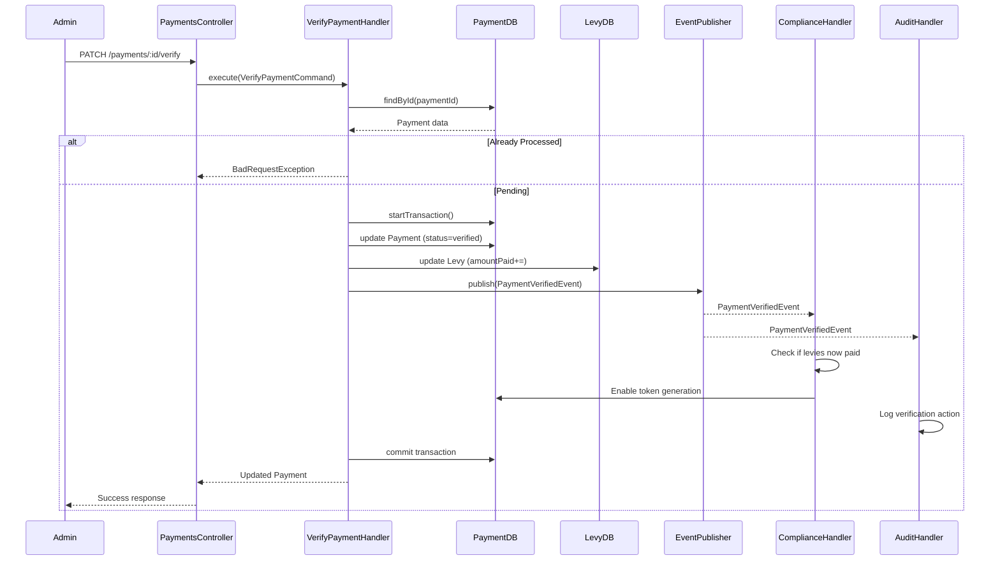

# Core Modules Deep Dive

## Overview

The Estate Management System consists of 9 major modules, each handling specific business domains:

| Module            | Purpose                             | Key Entities                    | File Location        |
| ----------------- | ----------------------------------- | ------------------------------- | -------------------- |
| **Auth**          | User authentication & session mgmt  | JWT, Pre-auth                   | `src/auth/`          |
| **Users**         | User management, roles, permissions | User, AdminDetails, Permissions | `src/users/`         |
| **Estates**       | Community/complex management        | Estate, metadata                | `src/estates/`       |
| **Properties**    | Property registry & metadata        | Property, unit info             | `src/properties/`    |
| **Payments**      | Payment processing & reconciliation | Payment, transaction records    | `src/payments/`      |
| **Levies**        | Assessment/fee management           | Levy, payment reminders         | `src/levies/`        |
| **Compliance**    | Automated enforcement rules         | Compliance rules, gates         | `src/compliance/`    |
| **Notifications** | Alerts & announcements              | Notification, push & email      | `src/notifications/` |
| **Audit Logs**    | Action tracking                     | AuditLog, event history         | `src/audit-logs/`    |

---

## 1. Authentication Module (src/auth/)

### Purpose

Handles user login, registration, email verification, password reset, and JWT token generation.

### Key Files

- `auth.controller.ts` - HTTP endpoint handlers
- `auth.module.ts` - Module configuration
- `cqrs/commands/handlers/` - Business logic handlers
- `guards/jwt-auth.guard.ts` - JWT validation
- `strategies/jwt.strategy.ts` - Passport JWT strategy

### Request Flow Diagram

```
User Login Request
    ↓
[POST /auth/login] LoginRequestDto
    ↓
LoginHandler (CQRS Command)
    ├─ Find user by email
    ├─ Validate password (bcrypt)
    ├─ Check email verification status
    ├─ Generate 6-digit OTP
    ├─ Publish UserVerificationEmailRequestedEvent
    └─ Return { access_token (pre-auth), status: 222 }
    ↓
Email Service (async event handler)
    ├─ Generate verification email
    └─ Send via Nodemailer
    ↓
User Receives Email with OTP
    ↓
[POST /auth/login/verify] VerifyLoginRequestDto(otp)
    ↓
VerifyLoginHandler (CQRS Command)
    ├─ Find user by pre-auth token
    ├─ Validate OTP code
    ├─ Create User session record
    ├─ Generate final JWT token
    └─ Publish UserLoggedInEvent
    ↓
Client Receives: { access_token, user_info, refreshToken }
```

### Endpoints

#### POST /auth/login

**Request:**

```json
{
  "email": "user@example.com",
  "password": "securePassword123"
}
```

**Response (First Step - Email Verification Required):**

```json
{
  "status": 222,
  "message": "Email not verified",
  "verified": false,
  "email": "user@example.com",
  "access_token": "eyJhbGciOiJIUzI1NiIsInR5cCI6IkpXVCJ9..."
}
```

**Response (Mobile User - Verified):**

```json
{
  "status": 200,
  "access_token": "eyJh... (JWT token)",
  "user": {
    "id": "user_123",
    "email": "user@example.com",
    "firstName": "John",
    "lastName": "Doe",
    "primaryRole": "tenant",
    "isEmailVerified": true
  }
}
```

**Code Snippet (Handler):**

```typescript
@CommandHandler(LoginCommand)
export class LoginHandler implements ICommandHandler<LoginCommand> {
  constructor(
    private usersService: UsersService,
    private jwtService: JwtService,
    private eventPublisher: EventPublisher,
  ) {}

  async execute(command: LoginCommand): Promise<any> {
    const { loginDto, isMobile } = command;
    const { email, password } = loginDto;

    // 1. Find user
    const user = await this.usersService.findByEmail(email);
    if (!user) {
      throw new BadRequestException('Invalid credentials');
    }

    // 2. Validate password
    const isPasswordValid = await bcrypt.compare(password, user.password);
    if (!isPasswordValid) {
      throw new BadRequestException('Invalid credentials');
    }

    // 3. Check if email verified (for non-Super Admin on web)
    if (!user.isEmailVerified && user.primaryRole !== UserRole.SUPER_ADMIN) {
      // ... generate OTP and publish event ...
      return {
        status: 222,
        message: 'Email not verified',
        access_token: this.jwtService.sign(preAuthPayload),
      };
    }

    // 4. If verified or mobile, generate final token
    const verificationToken = Math.floor(100000 + Math.random() * 900000);
    const event = new UserVerificationEmailRequestedEvent({
      userId: user._id,
      email: user.email,
      verificationToken,
    });
    await this.eventPublisher.publish(event);

    return {
      status: 200,
      message: 'Login pending email verification',
      access_token: this.jwtService.sign(finalPayload),
      user: this.mapToResponseDto(user),
    };
  }
}
```

#### POST /auth/register

**Request:**

```json
{
  "email": "newuser@example.com",
  "password": "securePassword123",
  "firstName": "Jane",
  "lastName": "Smith",
  "phoneNumber": "+2348012345678",
  "primaryRole": "tenant"
}
```

**Response:**

```json
{
  "message": "Registration successful, please verify your email",
  "email": "newuser@example.com",
  "userId": "user_456"
}
```

**Code Snippet:**

```typescript
@CommandHandler(RegisterCommand)
export class RegisterHandler implements ICommandHandler<RegisterCommand> {
  async execute(command: RegisterCommand): Promise<any> {
    const { registerDto } = command;

    // 1. Check if user exists
    const existingUser = await this.usersService.findByEmail(registerDto.email);
    if (existingUser) {
      throw new BadRequestException('Email already registered');
    }

    // 2. Hash password
    const hashedPassword = await bcrypt.hash(registerDto.password, 10);

    // 3. Create user
    const user = new this.userModel({
      ...registerDto,
      password: hashedPassword,
      isEmailVerified: false,
      verificationToken: generateToken(),
    });
    const savedUser = await user.save();

    // 4. Publish event (sends verification email async)
    const event = new UserRegisteredEvent({
      userId: savedUser._id,
      email: savedUser.email,
      verificationToken: savedUser.verificationToken,
    });
    await this.eventPublisher.publish(event);

    return {
      message: 'Registration successful',
      email: savedUser.email,
    };
  }
}
```

#### POST /auth/login/verify

**Request:**

```json
{
  "otp": "123456"
}
```

**Response:**

```json
{
  "access_token": "eyJhbGciOiJIUzI1NiIsInR5cCI6IkpXVCJ9...",
  "refreshToken": "ref_token_xyz",
  "user": {
    "id": "user_123",
    "email": "user@example.com",
    "firstName": "John",
    "primaryRole": "tenant",
    "isEmailVerified": true
  }
}
```

#### POST /auth/forgot-password

Initiates password reset flow. Sends OTP to email.

#### POST /auth/verify-reset-otp

Verifies OTP for password reset.

#### POST /auth/reset-password

Sets new password after OTP verification.

#### POST /auth/logout

Invalidates token by incrementing user's `tokenVersion`.

### JWT Payload Structure

```typescript
interface JwtPayload {
  sub: string; // User ID
  email: string; // User email
  roles: UserRole; // Primary role
  type: 'pre-auth' | 'auth'; // Stage of authentication
  isVerified: boolean; // Email verified?
  reason?: string; // If pre-auth, why (e.g., 'unverified_email')
  version: number; // Token version for invalidation
  iat?: number; // Issued at
  exp?: number; // Expiration
}
```

### Key Concepts

- **Pre-Auth Tokens**: Limited tokens for users pending email verification
- **Two-Step Login**: Mobile users verify email before accessing full system
- **Token Version**: Incrementing this value invalidates all previous tokens
- **Email Verification**: OTP-based, sent via email

---

## 2. Users Module (src/users/)

### Purpose

Manages user profiles, roles, permissions, and administrative hierarchy.

### Key Files

- `users.controller.ts` - HTTP endpoints
- `users.service.ts` - Database operations
- `user-management.service.ts` - Role-specific creation logic
- `entities/user.entity.ts` - MongoDB schema (User, AdminDetails, Permissions)
- `cqrs/commands/` and `cqrs/queries/` - CQRS handlers

### Entity Relationships

```
User (root schema)
├── _id (ObjectId)
├── email
├── password
├── firstName, lastName
├── primaryRole (enum: super_admin, admin, landlord, tenant, security, site_admin)
├── adminDetails (if role = admin)
│   ├── position (enum: facility_manager, security_head, finance_manager, etc.)
│   ├── positionPermissions: Permission[]
│   └── additionalPermissions: Permission[]
├── landlordDetails (if role = landlord)
├── tenantDetails (if role = tenant)
├── securityDetails (if role = security)
├── estateId (reference to Estate)
├── propertyId (reference to Property, for tenants)
├── isEmailVerified
├── isMfaEnabled
├── notificationPreferences
├── fcmTokens[] (for push notifications)
├── tokenVersion (for token invalidation)
├── createdBy (reference to User who created this)
├── deletedAt (for soft delete)
└── timestamps
```

### User Roles & Hierarchy

```
super_admin (1 user per system)
    ├─ Can create/manage all admins
    └─ Full permissions

site_admin (manages physical gates)
    └─ Controls gate pass system

admin (estate-specific managers)
    ├─ Position: facility_manager, security_head, finance_manager, etc.
    ├─ positionPermissions (role-specific defaults)
    └─ additionalPermissions (can be granted by super_admin)

landlord (property owner)
    ├─ Can create/manage properties
    ├─ View tenant profiles
    └─ Receive payment notifications

tenant (property resident)
    ├─ Can pay levies
    ├─ Request gate passes
    └─ Receive notifications

security (physical access point)
    ├─ Limited to verifying gate passes
    └─ No administrative access
```

### Permission System

```typescript
enum PermissionAction {
  CREATE = 'create',
  READ = 'read',
  UPDATE = 'update',
  DELETE = 'delete',
  MANAGE = 'manage', // Full control
  APPROVE = 'approve',
  ASSIGN = 'assign',
}

enum ResourceType {
  USERS,
  TENANTS,
  LANDLORDS,
  ADMINS,
  SECURITY,
  PROPERTIES,
  MAINTENANCE,
  FINANCES,
  REPORTS,
  SETTINGS,
  PERMISSIONS,
}

interface Permission {
  resource: ResourceType | AdminPosition;
  actions: PermissionAction[];
  conditions?: string[]; // e.g., "own_properties_only"
}
```

### Endpoints

#### POST /users/create/admin

**Request:**

```json
{
  "email": "admin@example.com",
  "password": "strongPassword123",
  "firstName": "John",
  "lastName": "Manager",
  "phoneNumber": "+2348012345678",
  "primaryRole": "admin",
  "adminDetails": {
    "position": "finance_manager",
    "department": "Finance",
    "customPositionTitle": null,
    "positionPermissions": [
      {
        "resource": "finances",
        "actions": ["create", "read", "update", "approve"]
      }
    ]
  },
  "estateId": "estate_123"
}
```

**Response:**

```json
{
  "id": "admin_user_123",
  "email": "admin@example.com",
  "firstName": "John",
  "lastName": "Manager",
  "primaryRole": "admin",
  "adminDetails": {
    "position": "finance_manager",
    "department": "Finance",
    "appointedAt": "2026-02-10T10:00:00Z"
  }
}
```

#### GET /users/:id

Fetch user by ID with full details including permissions.

#### PATCH /users/:id

Update user profile (name, phone, etc.).

#### POST /users/register-fcm-token

Register Firebase Cloud Messaging token for push notifications.

```json
{
  "token": "fcm_token_xyz",
  "deviceName": "iPhone 14",
  "platform": "ios"
}
```

#### PATCH /users/:id/permissions

Grant or revoke specific permissions to an admin.

```json
{
  "permissionsToAdd": [
    {
      "resource": "properties",
      "actions": ["create", "read", "update"]
    }
  ],
  "permissionsToRemove": [...]
}
```

#### POST /users/:id/enable-token-generation

Allow user to generate gate pass tokens (enable this after compliance check passes).

#### POST /users/:id/disable-token-generation

Revoke gate pass generation (triggered by unpaid levies).

### Code Snippet: Creating an Admin

```typescript
@CommandHandler(CreateAdminCommand)
export class CreateAdminHandler implements ICommandHandler<CreateAdminCommand> {
  constructor(
    @InjectModel(User.name) private userModel: Model<User>,
    private eventPublisher: EventPublisher,
  ) {}

  async execute(command: CreateAdminCommand): Promise<User> {
    const { createAdminDto, createdBy } = command;

    // 1. Hash password
    const hashedPassword = await bcrypt.hash(createAdminDto.password, 10);

    // 2. Validate unique email
    const existingUser = await this.userModel.findOne({
      email: createAdminDto.email,
    });
    if (existingUser) {
      throw new BadRequestException('Email already in use');
    }

    // 3. Create admin user with position permissions
    const adminUser = new this.userModel({
      ...createAdminDto,
      password: hashedPassword,
      primaryRole: UserRole.ADMIN,
      adminDetails: {
        position: createAdminDto.adminDetails.position,
        department: createAdminDto.adminDetails.department,
        positionPermissions: createAdminDto.adminDetails.positionPermissions,
        appointedBy: createdBy,
        appointedAt: new Date(),
      },
    });

    const session = await this.userModel.db.startSession();
    const savedAdmin = await session.withTransaction(async () => {
      const user = await adminUser.save({ session });

      // Publish event for audit logging
      const event = new AdminUserCreatedEvent({
        userId: user._id,
        email: user.email,
        position: user.adminDetails.position,
        createdBy,
      });
      await this.eventPublisher.publish(event, session);

      return user;
    });

    return savedAdmin;
  }
}
```

---

## 3. Payments Module (src/payments/)

### Purpose

Handles payment processing (manual & Paystack), reconciliation, and payment history.

### Key Files

- `payments.controller.ts` - Payment endpoints
- `payments.service.ts` - Payment logic
- `paystack.service.ts` - Paystack gateway integration
- `entities/payment.entity.ts` - Payment schema

### Payment Flow

```
Tenant Clicks "Pay Levy"
    ↓
Frontend shows payment options
    ├─ Manual transfer (bank account info)
    └─ Online (Paystack)
    ↓
If Paystack:
  [POST /payments/initialize-paystack]
    ├─ Creates Payment record (status: pending)
    ├─ Calls Paystack API
    └─ Returns checkout link
    ↓
  Tenant pays on Paystack
    ↓
  Paystack Webhook → [POST /payments/webhook/paystack]
    ├─ Verifies transaction
    ├─ Updates Payment (status: verified)
    ├─ Publishes PaymentVerifiedEvent
    └─ Triggers Compliance check
    ↓
  Audit log & notification sent
    ↓
If Manual:
  [POST /payments]
    ├─ Creates Payment (status: pending)
    ├─ Tenant uploads proof (receipt image)
    ├─ Admin receives notification
    ↓
  Admin reviews: [PATCH /payments/:id/verify]
    ├─ Confirms legitimacy
    ├─ Updates status to verified
    └─ Publishes PaymentVerifiedEvent
    ↓
  Compliance check triggered
```

### Endpoints

#### POST /payments

**Create manual payment submission**

**Request:**

```json
{
  "levyId": "levy_123",
  "amount": 50000,
  "paymentMethod": "bank_transfer",
  "proofOfPayment": "image_url_from_cloudinary",
  "referenceNumber": "TXN-2026-001",
  "notes": "Transferred from GTBank"
}
```

**Response:**

```json
{
  "id": "payment_789",
  "levyId": "levy_123",
  "userId": "tenant_456",
  "amount": 50000,
  "status": "pending",
  "paymentMethod": "bank_transfer",
  "createdAt": "2026-02-10T10:30:00Z"
}
```

#### GET /payments/my-payments

Get logged-in user's payment history.

**Response:**

```json
[
  {
    "id": "payment_789",
    "levyId": "levy_123",
    "levyName": "January Maintenance Levy",
    "amount": 50000,
    "status": "verified",
    "paymentMethod": "bank_transfer",
    "paidAt": "2026-02-10T10:30:00Z"
  }
]
```

#### GET /payments/pending

**(Admin only)** Get all pending manual payments for verification.

#### PATCH /payments/:id/verify

**(Admin only)** Verify a manual payment.

**Request:**

```json
{
  "verifiedAmount": 50000,
  "notes": "Receipt verified, legitimate"
}
```

#### PATCH /payments/:id/reject

**(Admin only)** Reject a payment.

**Request:**

```json
{
  "rejectionReason": "Receipt unclear, please resubmit"
}
```

#### POST /payments/initialize-paystack

Start Paystack online payment.

**Request:**

```json
{
  "levyId": "levy_123",
  "amount": 50000
}
```

**Response:**

```json
{
  "authorizationUrl": "https://checkout.paystack.com/...",
  "accessCode": "access_code_xyz",
  "reference": "TXN_2026_..."
}
```

### Paystack Integration

```typescript
// From: src/payments/paystack.service.ts

export class PaystackService {
  constructor(private configService: ConfigService) {
    Paystack.setBaseUrl('https://api.paystack.co');
    Paystack.setAuthorizationKey(this.configService.get('PAYSTACK_SECRET'));
  }

  async initializeTransaction(
    email: string,
    amount: number,
    reference: string,
  ) {
    try {
      const response = await Paystack.Transaction.initialize({
        email,
        amount: amount * 100, // Convert to kobo
        reference,
        callback_url: `${this.configService.get('BACKEND_URL')}/payments/callback`,
      });
      return response.data;
    } catch (error) {
      throw new BadRequestException('Paystack initialization failed');
    }
  }

  async verifyTransaction(reference: string) {
    try {
      const response = await Paystack.Transaction.verify({ reference });
      return response.data;
    } catch (error) {
      throw new BadRequestException('Payment verification failed');
    }
  }
}
```

### Code Snippet: Payment Verification Handler

```typescript
@CommandHandler(VerifyPaymentCommand)
export class VerifyPaymentHandler
  implements ICommandHandler<VerifyPaymentCommand>
{
  constructor(
    @InjectModel(Payment.name) private paymentModel: Model<Payment>,
    @InjectModel(Levy.name) private levyModel: Model<Levy>,
    private eventPublisher: EventPublisher,
  ) {}

  async execute(command: VerifyPaymentCommand): Promise<Payment> {
    const { paymentId, verifiedAmount, adminId } = command;

    const payment = await this.paymentModel.findById(paymentId);
    if (!payment) {
      throw new NotFoundException('Payment not found');
    }

    if (payment.status !== 'pending') {
      throw new BadRequestException('Payment already processed');
    }

    const session = await this.paymentModel.db.startSession();
    const verifiedPayment = await session.withTransaction(async () => {
      // Update payment status
      payment.status = 'verified';
      payment.verifiedAmount = verifiedAmount;
      payment.verifiedBy = adminId;
      payment.verifiedAt = new Date();
      await payment.save({ session });

      // Update levy with paid amount
      const levy = await this.levyModel.findById(payment.levyId);
      levy.amountPaid += verifiedAmount;
      levy.isPaid = levy.amountPaid >= levy.totalAmount;
      await levy.save({ session });

      // Publish event (triggers compliance check, audit log, notification)
      const event = new PaymentVerifiedEvent({
        paymentId: payment._id,
        userId: payment.userId,
        amount: verifiedAmount,
        levyId: payment.levyId,
      });
      await this.eventPublisher.publish(event, session);

      return payment;
    });

    return verifiedPayment;
  }
}
```

---

## 4. Levies Module (src/levies/)

### Purpose

Manages recurring assessments/fees charged to properties.

### Key Entities

```
Levy
├── _id
├── estateId
├── name (e.g., "Maintenance Levy January 2026")
├── description
├── levyType (enum: maintenance, security, utilities, etc.)
├── totalAmount
├── amountPaid
├── isPaid
├── dueDate
├── properties[] (which properties this applies to)
├── tenants[] (which tenants owe this)
├── createdBy (admin who created)
├── createdAt
└── deletedAt (soft delete)
```

### Key Workflows

1. **Create Levy**: Admin creates new levy for estate
2. **Auto-assign to Tenants**: Levy automatically assigned to all tenants in estate
3. **Payment Tracking**: Track who paid and how much
4. **Reminder Sending**: Automated reminders before due date
5. **Compliance Enforcement**: Restrict services if unpaid

---

## 5. Additional Modules

### Estates (src/estates/)

- Manages community/complex information
- Location, amenities, rules
- Primary entity that owns all other entities

### Properties (src/properties/)

- Individual units (apartments, houses) within an estate
- Metadata: address, unit type, floor
- Link tenants & landlords

### Compliance (src/compliance/)

- Automated enforcement rules
- Restricts gate pass generation if levies unpaid
- Checks configurable conditions

### Notifications (src/notifications/)

- Email & push notification delivery
- Integrates with Nodemailer & Firebase
- Async event handlers trigger notifications

### Audit Logs (src/audit-logs/)

- Records every user action
- Timestamps and change details
- Searchable audit trail

---

## Sequence Diagrams

### Login Flow



### Payment Verification Flow



---

**Continue to [04-endpoints-reference.md](04-endpoints-reference.md) for complete endpoint specification.**
