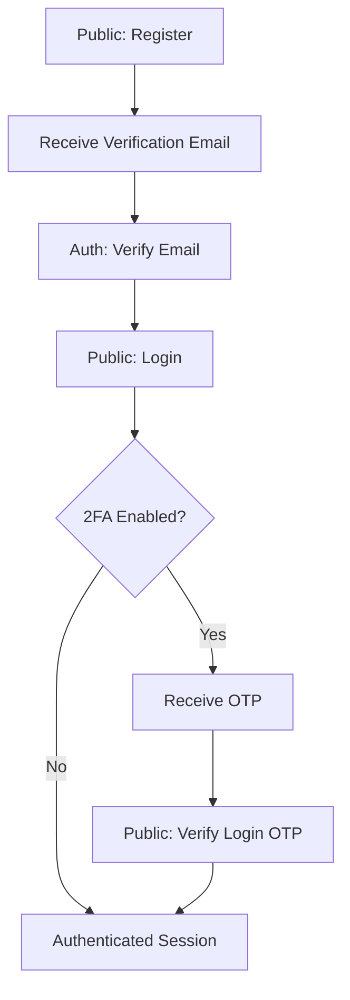
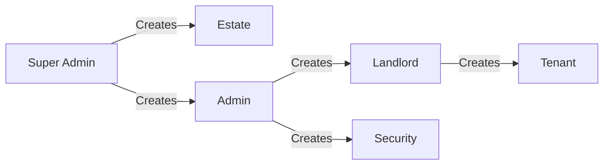
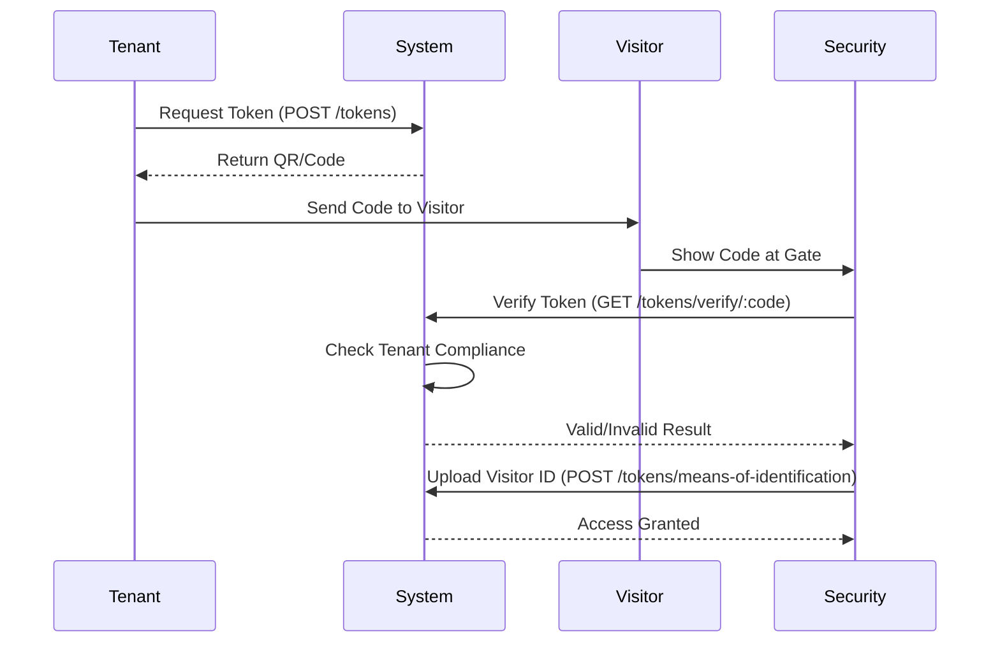
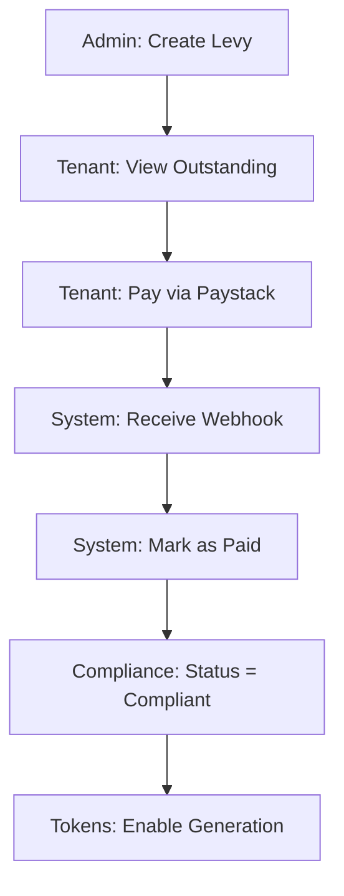

# QA Workflow & System Integration Guide

This document provides the QA team with a step-by-step guide to testing the core business flows of the Estate Management System.

---

## 1. Authentication & Identity Flow
This flow ensures users can securely join the platform and maintain their sessions.

### Flowchart

### Test Steps
1. **Registration**: Use `POST /auth/register`. Verify that an email is sent (check logs/Ethereal).
2. **Email Verification**: Use the code from the email with `POST /auth/verify-email`.
3. **Login**: Use `POST /auth/login`. If the user is on a new device or has 2FA, use `POST /auth/login/verify`.
4. **Profile Check**: Use the returned `accessToken` to call `GET /auth/profile`.

---

## 2. User Lifecycle & Estate Hierarchy
This flow tests the creation of the administrative structure.

### Flowchart

### Test Steps
1. **Estate Setup**: As a `SUPER_ADMIN`, create an estate using `POST /estates/create`.
2. **Admin Creation**: Create an `ADMIN` for that estate using `POST /users/create/admin`.
3. **Property Setup**: Create a property in the estate using `POST /properties`.
4. **Landlord/Tenant**: Create a `LANDLORD` and then a `TENANT` assigned to the property.

---

## 3. Visitor Management (Gate Pass)
The "Happy Path" for a visitor entering the estate.

### Flowchart

### Test Steps
1. **Token Generation**: As a `TENANT`, generate a token using `POST /tokens`.
2. **Compliance Check**: (Negative Test) Ensure token gen fails if the tenant has overdue levies.
3. **Security Check**: As `SECURITY`, verify the token using `GET /tokens/verify/:code`.
4. **Identification**: Security must upload a photo of the visitor's ID using `POST /tokens/means-of-identification`.

---

## 4. Billing, Payments & Compliance
Tests the automated enforcement of estate rules.

### Flowchart

### Test Steps
1. **Levy Assignment**: As `ADMIN`, create a levy for "All Tenants" using `POST /levies`.
2. **Status Check**: Call `GET /compliance/status` for a tenant. It should be `non-compliant`.
3. **Payment**: 
   - **Online**: Initialize using `POST /payments/initialize`, then simulate success at `GET /payments/paystack/verify/:ref`.
   - **Manual**: Submit via `POST /payments`, then as `ADMIN` use `PATCH /payments/:id/verify`.
4. **Re-Verification**: Call `GET /compliance/status` again. It should now be `compliant`.

---

## 5. RBAC & Security Matrix
QA should verify that roles cannot perform "Cross-Estate" or "Escalated" actions.

| Role | Can Create Token? | Can View Audit Logs? | Can Create Admin? |
| :--- | :--- | :--- | :--- |
| **TENANT** | Yes (if compliant) | No | No |
| **SECURITY** | No | No | No |
| **ADMIN** | Yes | No | Yes |
| **SUPER_ADMIN** | Yes | Yes | Yes |

---

## 6. Observability for QA
How to verify "Behind the Scenes" logic:
- **Audit Logs**: Check `GET /api/audit-logs` after any action. Every POST/patch should leave an audit trail.
- **Queue Monitoring**: Visit `http://localhost:3000/admin/queues` to see if emails or background events are stuck in the "Failed" tab.
- **Outbox**: Use MongoDB compass to check the `outboxevents` collection. Events should move from `pending` to `completed`.
