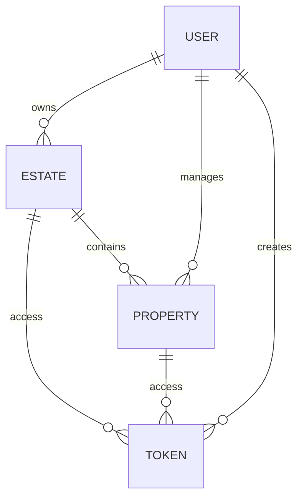

# Database Schema Documentation

The system uses MongoDB to store data. Below are the primary entities and their relationships.

## Core Entities

### 1. User
Represents any user in the system (Admins, Landlords, Tenants, Security).
- **Key Fields**: `email`, `password`, `primaryRole`, `estateId`.
- **Relationship**: Each user is optionally linked to an `Estate`. Landlords are linked to their `Tenants`.

### 2. Estate
Represents a managed estate.
- **Key Fields**: `name`, `location`, `owner`, `subscription`.
- **Relationship**: Owned by a `User` (typically a Super Admin or Landlord).

### 3. Property
An individual unit within an estate.
- **Key Fields**: `identifier`, `type`, `landlordId`, `estateId`, `tenantId`, `occupancyStatus`.
- **Relationship**: Linked to one `Estate`, one `Landlord`, and optionally many `Tenants`.

### 4. Token (Gate Pass)
Used for visitor access.
- **Key Fields**: `token`, `visitorName`, `visitorType`, `user` (creator), `estate`, `expiresAt`, `used`.
- **Relationship**: Created by a `User`, linked to an `Estate` and optionally a `Property`.

## Relationship Overview

